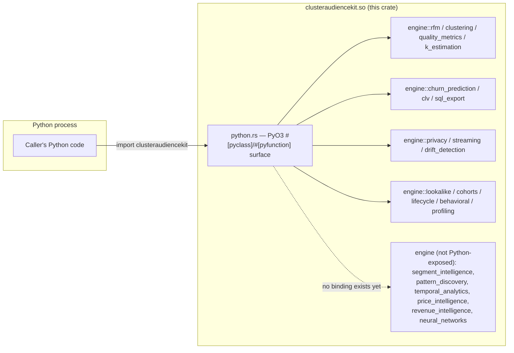
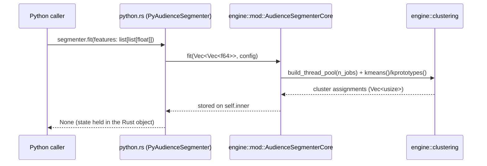

# Architecture

This replaces two previous architecture docs (root `ARCHITECTURE.md` and
`docs/architecture.md`, both now in `docs/archive/`) that described module
layouts and cross-project integrations (`StatGuardian`, `PyCustomerJourney`,
`PyReverseETL`, `PyStreamMCP`, a `core/src/` directory tree) that never
existed in this codebase. Everything below was checked directly against
`src/` as of this writing (v7.3.1).

## What this actually is

A single Rust crate (`clusteraudiencekit`, no Cargo workspace) compiled as a
`cdylib` via [PyO3](https://pyo3.rs) and packaged as a Python extension
module with [maturin](https://github.com/PyO3/maturin). There is no server,
no CLI, and no dependency on any other Mullassery project — it's a library,
imported as `import clusteraudiencekit` in Python.

## Layout

```
src/
├── lib.rs           # crate root: re-exports, error type, version const
├── python.rs         # PyO3 binding layer — the only file that talks to Python
├── utils/
│   ├── conversions.rs  # pandas<->Arrow helpers (see note below — 2 stubs)
│   └── validation.rs
└── engine/           # 34 modules, no submodule ever imports python.rs
    ├── rfm.rs, clustering.rs, quality_metrics.rs, k_estimation.rs,
    │   churn_prediction.rs, clv.rs, sql_export.rs, privacy.rs,
    │   streaming.rs, drift_detection.rs, lookalike.rs, cohorts.rs,
    │   lifecycle.rs, behavioral.rs, profiling.rs, segments.rs
    │   — wired to Python via python.rs (see README's "What's real today" table)
    ├── segment_intelligence.rs, pattern_discovery.rs, temporal_analytics.rs,
    │   price_intelligence.rs, revenue_intelligence.rs, neural_networks.rs
    │   — real, `cargo test`-covered, but NOT called from python.rs at all
    └── governance.rs, b2b_governance.rs, b2b_segmentation.rs, dashboard.rs,
        plugins.rs, platform_adapters.rs, activation.rs,
        activation_orchestrator.rs, algorithms.rs, metrics.rs,
        heuristic_score_estimator.rs
        — deliberately out of scope or superseded; see docs/ROADMAP_HONEST.md
          for why each one is where it is
```

`engine::metrics` predates and duplicates part of `engine::quality_metrics`
(the one actually wired to Python) — it is not called from `python.rs` or
from any other `engine::` module; it is dead code, not an alternate
implementation in active use.

## Request flow

There is no request/response cycle — this is a library called in-process.
The only boundary is the PyO3 binding layer:



## Data flow inside a typical call (`AudienceSegmenter.fit`)



`n_jobs` (scikit-learn convention: `-1` = all cores, `>0` = capped) controls
a scoped `rayon::ThreadPool` built fresh per call in
`engine::clustering::build_thread_pool` — it is not a global setting.

## Why this is a single crate, not a workspace

There's one `Cargo.toml` at the repo root with `[lib] crate-type =
["cdylib", "rlib"]` — `cdylib` for the Python extension, `rlib` so
`cargo test`/`benches/benchmarks.rs` can link against the crate as a normal
Rust library. No `[workspace]` section exists; `Cargo.lock` is committed
(not gitignored) for reproducible builds.

## Known structural issues (see docs/ROADMAP_HONEST.md for full detail)

- `src/utils/conversions.rs`'s `pandas_to_arrow`/`arrow_to_pandas` are
  unimplemented stubs (`Err("Not implemented")`) — not called from anywhere,
  so they don't affect any documented functionality, but they exist as dead
  weight.
- `engine::metrics` is unused/duplicate code relative to
  `engine::quality_metrics` (see above).
- `cargo test` cannot run at all on macOS in a plain `cargo test` invocation
  (SIGABRT — `dyld: symbol not found '_PyBaseObject_Type'`) because
  `pyo3`'s `extension-module` feature is unconditionally enabled in
  `Cargo.toml` rather than feature-gated. `maturin develop` + `pytest
  tests/` is the working way to exercise this code on macOS today. See
  `docs/ROADMAP_HONEST.md`.
